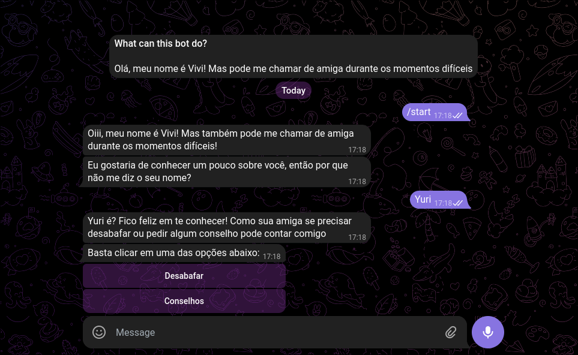

<!-- Badges: https://github.com/Ileriayo/markdown-badges -->

[TELEGRAM_BADGE]: https://img.shields.io/badge/Telegram-2CA5E0?style=for-the-badge&logo=telegram&logoColor=white
[DIALOGFLOW_BADGE]: https://img.shields.io/badge/Dialogflow-ef6c00?style=for-the-badge&logo=dialogflow&logoColor=white
[JSON_BADGE]: https://img.shields.io/badge/json-333333.svg?style=for-the-badge&logo=json&logoColor=whitE

<!-- Official websites of the technologies used -->

[TELEGRAM_SITE]: https://telegram.org
[DIALOGFLOW_SITE]: https://dialogflow.cloud.google.com
[JSON_SITE]: https://json.org

# 😊 Vivi

[![TELEGRAM][TELEGRAM_BADGE]][TELEGRAM_SITE]
[![DIALOGFLOW][DIALOGFLOW_BADGE]][DIALOGFLOW_SITE]
[![JSON][JSON_BADGE]][JSON_SITE]

Vivi é um chat-bot simples de apoio emocional integrado ao Telegram e feito com Dialogflow ES

## 🖼️ Demo

